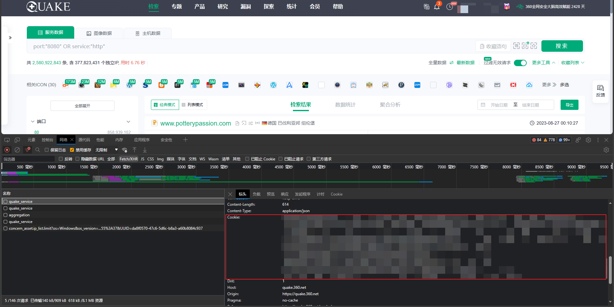

# 360网络空间测绘爬虫
功能：
1. 爬取quake中的资产
2. 支持自定义搜索语法
3. 默认加入`AND service: "http" AND is_domain:"false"`语法
4. 默认去除cdn、蜜罐、无效请求
5. 突破网页1w条数据的限制

TODO:
1. 根据ip和域名列表查询对应资产
2. 显示资产地图经纬度
3. ……

使用方法：
1. 浏览器打开开发者工具(F12)，找到cookie然后写入`config.ini`中

   

2. 终端运行
    ```shell 
    python3 360QuakeSpider.py
    ```
3. 输入搜索语法例如：
    ```shell
   app:"海康威视"
    ```
4. 等待爬取完成